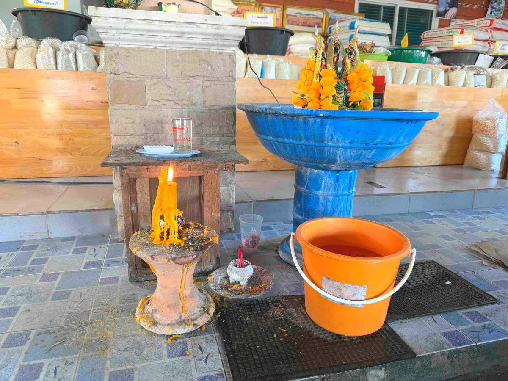

# 20250113_chiangrai

<html>
<head>

<meta charset="UTF-8">
<meta http-equiv="Content-Type" content="text/html; charset=UTF-8">
<meta http-equiv="X-UA-Compatible" content="IE=EmulateIE10" />
<meta http-equiv="X-UA-Compatible" content="IE=edge">

<!--ここから上はお決まりの定型文です-->

<!--ここからが表現の書式などを決めるcssという部分-->

<link href="https://cdnjs.cloudflare.com/ajax/libs/lightbox2/2.7.1/css/lightbox.css" rel="stylesheet">

</head>

<body>

モバイル端末をお使いの場合は、画面を横向きにすると
より見やすくご覧頂けます。

<!--ここ上は、ほぼそのまま使います！-->

<!--QRコードの挿入例-->

 アクセス用QRコード

<marquee direction="left" scrollamount="20" width="30%">(^_^)/~alis</marquee>

<!--流れ文字の挿入例-->
<h1><marquee behavior="left">!!! 2025/01/13 、VISA延長の手続きで町役場と入管を奔走!!!</marquee></h1>

                          

<!--ここから下が、本体部分-->

<h2>滞在VISAを延長するうまい方法があるとのことで奔走しました 最寄りの町メーチャンの警察署で役場の位置を確認します</h2>

<h2>婦警さんは飲み物持って出勤</h2>

<h2>役場は警察署のお隣なので歩いて移動</h2>

<h2>日本の役場と違って派手な彩り</h2>

<h2>整理券取って順番待ち</h2>

<h2>証明用の顔写真は部屋の隅で撮影してます</h2>

<h2>端末でデータを探してもらうも、バンコクからデータが来てない！</h2>

<h2>警備の警官が笑顔でお見送り</h2>

<h2>トイレの男女マークの色使いがまちまちなのはタイのゆるいところ</h2>

<h2>こちらの管理は万全です</h2>

<h2>チェンライのCENTRALにあるIMMIGRATIONにまたまたお邪魔します</h2>

<h2>いつ来ても混雑気味</h2>

<h2>手続きごとに用意されたQRコード</h2>

<h2>VISA延長は多発するので、説明図がありました</h2>

<h2>水とコーヒーはセルフサービスで無料</h2>

<h2>ハリウッドスター並にカッコいい白人のお父さん</h2>

<h2>午前中は時間切れでお昼ご飯に行きます 先日のイベントスペースは空っぽ</h2>

<h2>お昼はフードコートに移動</h2>

<h2>今回のお昼はエビ抜きのチャーハンと焼肉チャーハン</h2>

<h2>野菜売り場に現れた、体型に迫力のある店員さん</h2>

<h2>スーパーの通路ではお姉さんに怒られるも、制御が破綻して困り顔のロボット君 </h2>

<h2>IMMIGRATIONに戻って待ちます 前に席は先ほどのハリウッドスター、体格がすごい！</h2>

<h2>役場にデータが来てなかったのでVISAを１ヶ月だけ延焼して帰路に 街中で見かける白人のご夫婦は元気そうです</h2>

<h2>100台に１台くらいの割合でいる、RrのNo無し車両 Frのナンバーはついていました 後ろから写真撮られる自動取締りカメラ対応ですね</h2>

<h2>途中の市場で手作り仏壇を見ると蝋燭の火、満月の夜は神様の日とのこと</h2>

<h2>日が暮れるとまんまるお月様</h2>

<h2>毎日見ても見飽きない、夕焼けグラデーションに金星もピカリ</h2>

<h2>日がとっぷり暮れると星空が綺麗です 明るい月は木に隠して、オリオン座と冬の大三角形はトレース、ひときわ明るい木星も目立ってました</h2>

   
<h2>以上、今回はお堅い場所や取り留めのない画像集でした、ここまで観ていただきありがとうございました。</h2>

     
<h2>
<a href="https://torokoid.github.io/20241126_chiangrai/" target="_blank">Back to the menu page</a>
</h2>

   

         

  

      

<!--本体はここまで-->

<!--画面に空白地帯を作って、背景が見えるようにしています-->
                                              

<!-- フッタ -->
<footer>

Copyright 2025/01/14 alis @ChiangRai

</footer>

<!--HPにさまざまなJavaScriptを呼び込むための書式-->

